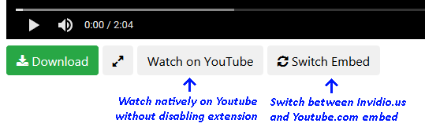

# hooktube extra

autorediects youtube.com videos to hooktube.com, a lightweight shell for youtube.

replaces hooktube's video embed with one from invidio.us, a youtube mirror.

(invidious is also a very good lightweight youtube on its own)

## huh?

normal youtube, just faster and a bit more privacy friendly.

if a vid doesn't load with the invidio.us embed, it can be switched to native youtube with the 'switch embed' button.
if the vid _still_ doesn't load, you can view it directly on youtube with the 'watch on youtube' button.

**all** youtube.com links get redirected to hooktube.com! individual videos can be watched on youtube, but the extension needs to be disabled to browse youtube normally.
